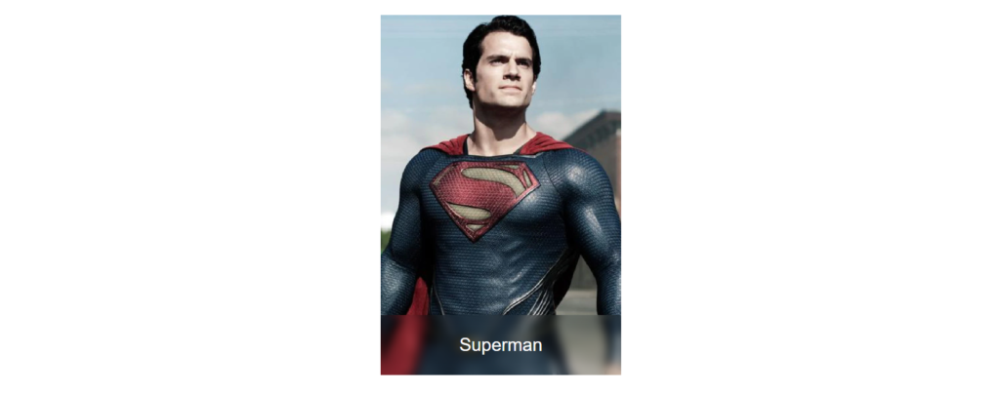

Привет! В этой статье мы сделаем blur-эффект для текста. Статья написана еще до внедрения `backdrop-filter`.



Сделать такое можно вполне несложно с помощью `filter: blur()`. Но, конечно, не все так просто :) Начнем с разметки:

## HTML

``` html
<div class="block block--blur">
  <div class="block__man" id="superman">
    <figure>
      
      <figcaption class="block__caption">
        <div class="block__name">Superman</div>
      </figcaption>
    </figure>
  </div>
</div>
```

Разметка довольно тривиальная, единственное что тут нужно — это картинка и id для блока. Поехали к магии — CSS. Но сперва первичная разметка:

## CSS (превичный)

``` css
* {
  margin: 0;
  padding: 0;
  box-sizing: border-box;
  font-family: sans-serif;
}

.block {
  display: flex;
  align-items: center;
  justify-content: center;
  min-height: 100vh;
}

.block__man {
  position: relative;
  width: 400px;
  height: 600px;

  figure {
    width: 100%;
    height: 100%;
  }

  img {
    width: 100%;
    height: 100%;
    object-fit: cover;
  }
}

.block__caption {
  position: absolute;
  left: 0;
  bottom: 0;
  width: 100%;
  height: 100px;
  color: #fff;
  text-align: center;
}

.block__name {
  position: relative;
  z-index: 50;
  display: flex;
  align-items: center;
  justify-content: center;
  width: 100%;
  height: 100%;
  font-size: 30px;
}
```

Это базовые стили, которые просто делают карточку. Но они тоже важны, поэтому решил разделить.

## CSS (сама магия)

``` css
.block--blur {
  .block__caption {
    overflow: hidden;

    &::before, &::after {
      content: '';
      position: absolute;
      top: 0;
      left: 0;
      width: 100%;
      height: 100%;
      background-repeat: no-repeat;
      background-position: center bottom;
      background-size: 100% auto;
      filter: blur(8px);
    }

    &::before {
      transform: scale(1.1);
    }
  }

  #superman {
    .block__caption::before,
    .block__caption::after {
      background-image: url('https://cdn.newsapi.com.au/image/v1/28811c194076a2f2730455884bdf29ae');
    }
  }
}
```

Используем класс-модификатор `block--blur`. Для подписи (которая и будет блюрена) задаем `overflow: hidden`. Используем два псевдоэлемента `::before` и `::after`, в которых будет фон все той же картинкой. Благодаря `background-position: center bottom` и `background-size: 100% auto` выставляем ее как надо. И, конечно же `filter: blur(8px)` задает сам блюр-эффект.

Тут еще важный момент - как видите, `::before` используется со скейлом. Это сделано для того, чтобы не было видно детали блюра от `::after`. Если уберете скейл с `::before` - думаю разницу увидите.

По традиции, пен:

<iframe title="Blured" src="//codepen.io/MaxGraph/embed/Pgawoy/?height=265&amp;theme-id=0&amp;default-tab=css,result" allowfullscreen></iframe>

Надеюсь, Вам было интересно. такой эффект я раньше очень долго искал, т.к. он мне нравится. Даже думал сделать на блог, но пока не дошли руки)

Удачи, и до скорого!
