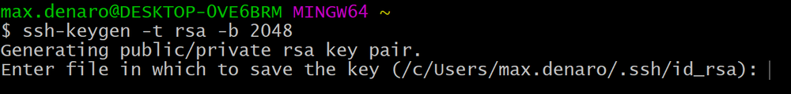
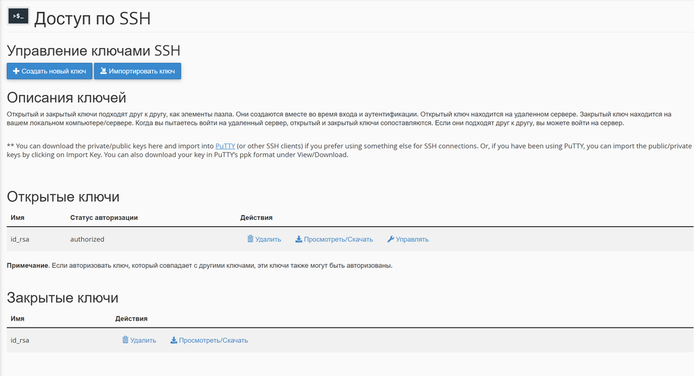
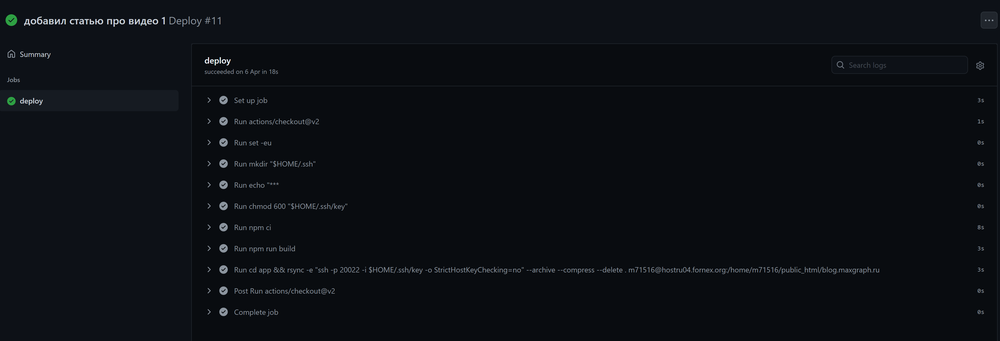

<iframe src="https://www.youtube.com/embed/_8sN0AaEVyE" allow="accelerometer; autoplay; clipboard-write; encrypted-media; gyroscope; picture-in-picture; web-share" allowfullscreen></iframe>

## Что потребуется

Итак, чтобы разобраться со всей этой темой, вам понадобится:
1. Базовые навыки работы с Git. Коммиты, пуши, пуллы и все такое.
2. Хостинг, поддерживающий подключение по SSH.
3. GitHub-репозиторий с поддержкой GitHub Actions (насколько я знаю, они работают везде, но мало ли).

## Принцип

Вкратце скажу принцип работы всего этого действа: когда мы будем пушить данные в репозиторий, сработает GitHub Action, которому сказано подключиться к вашему хостингу по SSH и залить туда данные с помощью rsync.

## Создание SSH-ключа

Итак, самое первое, что нам стоит сделать, это создать SSH-ключи – приватный и публичный. Лучше всего это делать непосредственно в консоли гита - Git Bash. Если же вы на Mac – подойдет и Терминал.

Открываем Git Bash, вводим следующую команду:

``` js
ssh-keygen -t rsa -b 2048
```

При использовании команды указывать парольную фразу не нужно.

<figure>

<figcaption>Скриншот из консоли при вводе команды создания ключа</figcaption>
</figure>

Данная команда создаст ключи и поместит их в папку __.ssh__ на вашем ПК. К сожалению, не знаю, куда именно попадают ключи на Mac, но думаю вы легко найдете это в гугле. А на винде - __C:\Users\ИмяПользователя\.ssh__. Если же вы откроете Bash в этой же папке - ключи попадут прямо в нее. Главное, не забудьте удалить их оттуда, чтобы они не попали в файлы репозитория!

В этой папке вы найдете ключи __id_rsa__ и __id_rsa.pub__, приватный и публичный ключи соответственно.

## Добавление ключей

Итак, когда вы создали ключи, их нужно добавить на хостинг и в репозиторий. Как именно устроено это на разных хостингах, я знать не могу, но покажу на примере cPanel, как это выглядит.

<figure>

<figcaption>Скриншот из cPanel, доступ по SSH</figcaption>
</figure>

Добавляем __id_rsa.pub__ в публичные ключи репозитория, если потребуется, авторизуем его (просто нажатием кнопки), и сохраняем.

Теперь идем в репозиторий GitHub, переходим в __Settings__, оттуда переходим в __Secrets__. Внутри нужно будет назвать секрет и ввести приватный ключ (сохраните его заранее в буфер обмена). Называйте ключ просто – _key_, вставляйте ключ и сохраняйте.

Готово, оба ключа введены и должны работать.

## Пишем файл для деплоя

Чтобы сделать собственно сам деплой, то есть дать понять гиту, что при изменении кода надо залить его на удаленный сервер, нам нужно написать скрипт на языке __Yaml__. Ниже я приложу код, вникать в него вовсе необязательно, но ниже я укажу действительно важные моменты.

``` yml
name: Deploy

on:
  push:
    branches:
      - main

jobs:
  deploy:
    runs-on: ubuntu-latest
    steps:
      - uses: actions/checkout@v2
      # Setup key
      - run: set -eu
      - run: mkdir "$HOME/.ssh"
      - run: echo "${{ secrets.key }}" > "$HOME/.ssh/key"
      - run: chmod 600 "$HOME/.ssh/key"
      # Build
      - run: npm ci
      - run: npm run build
      # Deploy
      - run: cd app && rsync -e "ssh -p 20022 -i $HOME/.ssh/key -o StrictHostKeyChecking=no" --archive --compress --delete . m71516@hostru04.fornex.org:/home/m71516/public_html/blog.maxgraph.ru

```

1. Итак, название файла deploy.yml
2. Внутри также указан name: Deploy
3. А далее указано действие, по которому сработает скрипт - `on: push: branches: main`. То есть, когда вы будете пушить что-то в ветку __main__ – сработает скрипт. Конечно, если у вас другая ветка – можете поменять ее.
4. Далее указана "работа", или же __jobs__. Там описано, где именно будет запускаться все это и как. А также указан путь к ключам, как `- run: echo "${{ secrets.key }}" > "$HOME/.ssh/key"`. Как раз тут и указано наше название ключа, _key_, которое мы писали в секретах.

И самая интересная для нас часть кода - это _build_ и _deploy_.

``` yml
# Build
- run: npm ci
- run: npm run build
```

Первая строка по факту равноценна привычному `npm i`, просто через _ci_ установить все это на гите быстрее.
Вторая же строка - это строка опциональная. Если у вас в проекте есть npm-скрипт build - используйте. Если у вас вообще нет npm-скриптов - удалите эти строчки.

``` yml
# Deploy
- run: cd app && rsync -e "ssh -p 20022 -i $HOME/.ssh/key -o StrictHostKeyChecking=no" --archive --compress --delete . m71516@hostru04.fornex.org:/home/m71516/public_html/blog.maxgraph.ru
```

Ну а здесь происходит буквально деплой данных. Сперва, командой `cd app` мы переходим в папку app (опять же, абсолютно опциональная вещь, если у вас просто нет папки app и никуда не надо переходить – можно убрать эту команду). Ну и далее для нас важна только строка, указывающая, _куда_ все это деплоить:

``` yml
m71516@hostru04.fornex.org:/home/m71516/public_html/blog.maxgraph.ru
```

Это полный путь к моему серверу, причем в конце еще и указан адрес конкретного сайта, в данном случае __blog.maxgraph.ru__. Если вдруг вы не знаете этот путь – можете уточнить у поддержки вашего хостинга. И будьте внимательны, чтобы случайно не задеплоить данные не туда, куда надо, ведь подобный деплой полностью затирает то, что было ранее.

## Что дальше

Итак, файлик __deploy.yml__ нужно поместить в ваш проект в специальную папку __.github__, чтобы гитхаб о ней узнал, и затем просто запушить проект.

После пуша вы сразу можете перейти во вкладку actions вашего репозитория и вживую посмотреть, как все команды из yml файла выполняются прямо там.

<figure>

<figcaption>Скриншот вкладки GitHub Actions с рабочим запуском deploy.yml</figcaption>
</figure>

## Заключение

Надеюсь, данная статья была вам полезна. Если же вам интересна видео-версия – в начале статьи есть видео, переходите и смотрите! До скорого!
