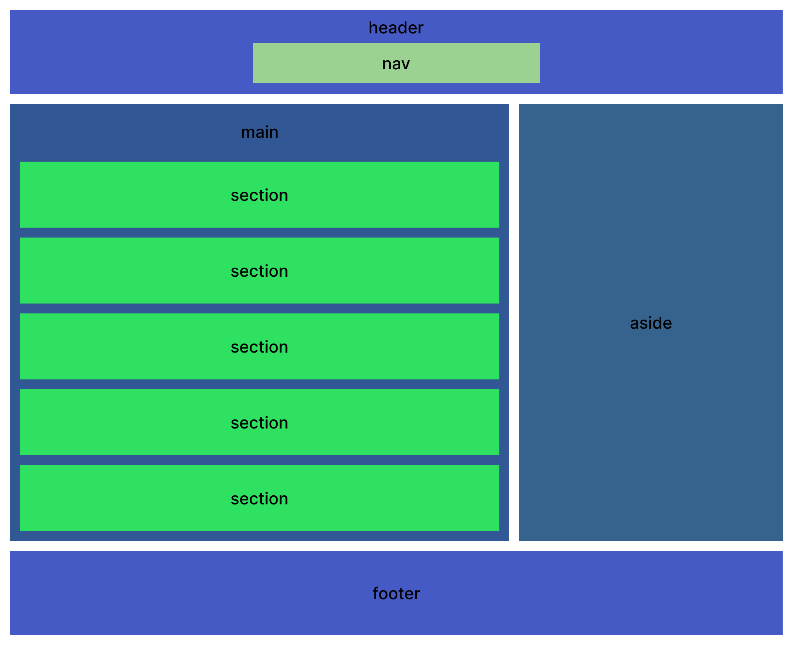
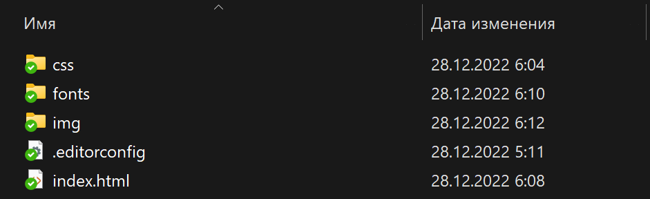

<iframe src="https://www.youtube.com/embed/FqtJkf5GmFs" allow="accelerometer; autoplay; clipboard-write; encrypted-media; gyroscope; picture-in-picture; web-share" allowfullscreen></iframe>

<h2 id="intro">Вступление</h2>

Привет! Представь, что ты открыл свой первый макет в Figma (например, <a href="https://verstaem.online/projects/castaway/" target="_blank">такой</a>). Что же делать дальше? Как распланировать процесс работы так, чтобы верстка была простой, гибкой и удобной? Давайте разбираться.

<h2 id="osmotr-maketa">Первичный осмотр макета</h2>

Первым делом нужно осмотреть весь макет, чтобы сразу увидеть все подводные камни, одинаковые элементы и т.д.
Смотрите по принципу "Большой блок - маленький блок", сперва обращая внимание на секции, а затем на внутренности этих секций.

### Структура страницы

Выделите все структурные элементы страницы:

1. `<header>` - шапка сайта
2. `<main>` - главный контент на странице
3. `<section>` - разделы страницы
4. `<footer>` - подвал сайта

Далее стоит смотреть вглубь этих разделов, и здесь поможет известная всем схема __Holy Grail Layout__ (англ. Святой Грааль). Так эту схему назвали верстальщики, ведь практически каждый сайт использует ее.

<figure>
  
  <figcaption>Как выглядит Holy Grail Layout</figcaption>
</figure>

Схема эта конечно немного утрирована, и `aside` на сайте вы скорее всего не встретите, но общая концепция такова.


### Внутренний контент

После разделения страницы на структурные блоки стоит посмотреть внутрь их - распознать, где ссылки, где абзацы, где выпадающее меню и т.д.

Отметьте себе:

1. Заголовки - и заголовок всего документа, и отдельные - `<h1>-<h6>`
2. Абзацы с текстом или просто мелкие надписи - `<p>` или `<span>`
3. Фразовые элементы - изображения, ссылки, кнопки, видео, и так далее.

<div class="note">
  <p>
    С этим помогут наши статьи <a href="https://verstaem.online/blog/razbor-bazovykh-html-tegov/" target="_blank">Разбор базовых HTML-тегов</a> и <a href="https://verstaem.online/blog/semanticheskie-tegi-v-html/" target="_blank">Семантические теги в HTML</a>, или же мои видео на Youtube: <a href="https://www.youtube.com/watch?v=fjBJMgGcd5k&list=PLCMvV-acWe2DhibYpMj1icazktoUoqEoo&ab_channel=MaxGraph-c%D0%B0%D0%B9%D1%82%D1%8B%D0%BA%D0%B0%D0%BA%D1%81%D1%82%D1%80%D0%B0%D1%81%D1%82%D1%8C" target="_blank">Назначение HTML-тегов</a>
  </p>
</div>

Когда вы сделаете это, у вас уже будет готовая схема верстки.

<h2 id="redaktor-koda">Редактор кода</h2>

Подготовьте редактор кода к работе (это может быть VS Code):

1. Установите плагин <a href="https://marketplace.visualstudio.com/items?itemName=EditorConfig.EditorConfig" target="_blank">EditorConfig for VS Code</a>, он нужен для написания кода в едином стиле
2. Установите плагин <a href="https://marketplace.visualstudio.com/items?itemName=ritwickdey.LiveServer" target="_blank">Live Server</a> для быстрого обновления страницы при сохранении

После этого подготовьте себе правильную структуру проекта. Как правило, она всегда одна:

<figure>
  
  <figcaption>Типичная структура проекта</figcaption>
</figure>

<a href="/assets/for-blog/kak-sverstat-sajt-po-maketu/project-structure.zip" download="Структура проекта">Скачать архив с базовой структурой проекта</a>

<h2 id="razmetka">Разметка</h2>

После подготовки проекта стоит приступить к его разметке, без стилей:

1. Создайте страницу index.html (или используйте страницу из приложенной выше структуры)
2. Разметьте всю страницу - ссылки, кнопки, заголовки и так далее
3. Напишите правильный `lang` и `<title>` для страницы.

Не запутаться в тегах помогут наши статьи, ссылки на них размещены выше.

<h2 id="bazovaya-stilizacziya">Базовая стилизация</h2>

Теперь нужно сделать базовую стилизацию проекта. Это - базовые сбросы и normalize.css, а также подключение шрифтов.

<a href="https://necolas.github.io/normalize.css/" target="_blank">Normalize.css</a> нужен, чтобы привести различия между элементами в разных браузерах к одному виду.

Базовый сброс, который я рекомендую для проектов:

``` css
html {
  box-sizing: border-box;
}

*,
*::before,
*::after {
  box-sizing: inherit;
}

a {
  color: inherit;
  text-decoration: none;
}

img {
  max-width: 100%;
}

body {
  font-family: 'font', sans-serif;
}
```

Далее подключаем шрифты. Сейчас для всех проектов достаточно формата woff2:

``` css
@font-face {
  font-family: 'Muller';
  src: url('../fonts/MullerLight.woff2') format('woff2'),
    url('../fonts/MullerLight.woff') format('woff');
  font-display: swap;
  font-weight: 300;
  font-style: normal;
}
```

Помимо этого можно также набросать фон, кастомные свойства (css-переменные), начать выделять в отдельные классы одинаковые элементы.

<h2 id="rabota-s-grafikoj">Работа с графикой</h2>

На этом этапе можно вырезать всю графику из Figma, чтобы потом было проще работать.
Необходимо помнить важные правила:

1. Если изображение контентое (важное для повествования, смысла) - используем тег ``
2. Если же декоративное - есть два варианта. Если иконка будет менять цвет в результате действий пользователя - используйте тег `<svg>`, если нет - используйте `background-image`.

И также не забывайте о форматах изображений:

1. Для изображений, не требующих прозрачности, используйте формат jpg
2. Для изображений с прозрачным фоном - png
3. Для иконок - svg

Также рекомендую использовать формат webp для лучшей оптимизации сайта.

<h2 id="strukturnyj-css">Структурный CSS</h2>

Теперь пора переходить к тому, чтобы стилизовать структуру:

1. Выделить контейнер
2. Сделать сетку - разместить элементы на своих местах, сделать между ними отступы и т.д.

Для большой структурной стилизации (списки контента, карточки и т.д.) советую CSS Grid, для мелкой (меню и т.д.) - CSS FlexBox.

<h2 id="dekorativnyj-css">Декоративный CSS</h2>

Теперь стоит "допилить" стили проекта - полностью сделать все в соответствии с макетом, попутно добавляя различные декоративные элементы и так далее.

<h2 id="adaptive">Адаптив</h2>

Последний этап перед продакшном - это адаптивная верстка. Проверьте, чтоб ваш сайт идеально смотрелся на любом устройстве. Здесь можно использовать:

1. Media-запросы
2. Элемент `<picture>` для создания адаптивных изображений
3. Относительные единицы измерения, такие как % и т.д.

Впрочем, тема адаптива - отдельная сложная тема, которую не рассказать внутри одной статьи. Но вы можете посмотреть видео на моем канале: <a href="https://www.youtube.com/watch?v=SP0-UTdcsgg&list=PLCMvV-acWe2AxKVUBQTza2sUp-fGn8zGh&ab_channel=MaxGraph-c%D0%B0%D0%B9%D1%82%D1%8B%D0%BA%D0%B0%D0%BA%D1%81%D1%82%D1%80%D0%B0%D1%81%D1%82%D1%8C" target="_blank">Адаптивная верстка</a>

<h2 id="zaklyuchenie">Заключение</h2>

Если вы сделали все предыдущие пункты, ваша верстка готова. Остается лишь проверить его, чтобы убедиться в правильности, и можно в прод!

Пользуйтесь небольшим <a href="https://recommend.maxgraph.ru/" target="_blank">чеклистом проверки проекта</a>, чтобы все было в порядке.

Удачи в работе!

<h2 id="poleznye-ssylki">Полезные ссылки</h2>

1. <a href="https://verstaem.online/projects/" target="_blank">Макеты любой сложности</a>
2. <a href="https://verstaem.online/tasks/" target="_blank">Задачки на отработку навыков</a>
3. <a href="https://youtu.be/zwB3nrWU3gA" target="_blank">Адаптивная верстка сайта с нуля с пояснениями №1</a>
4. <a href="https://youtu.be/D8DqoTjd_dg" target="_blank">Адаптивная верстка сайта с нуля с пояснениями №2</a>
