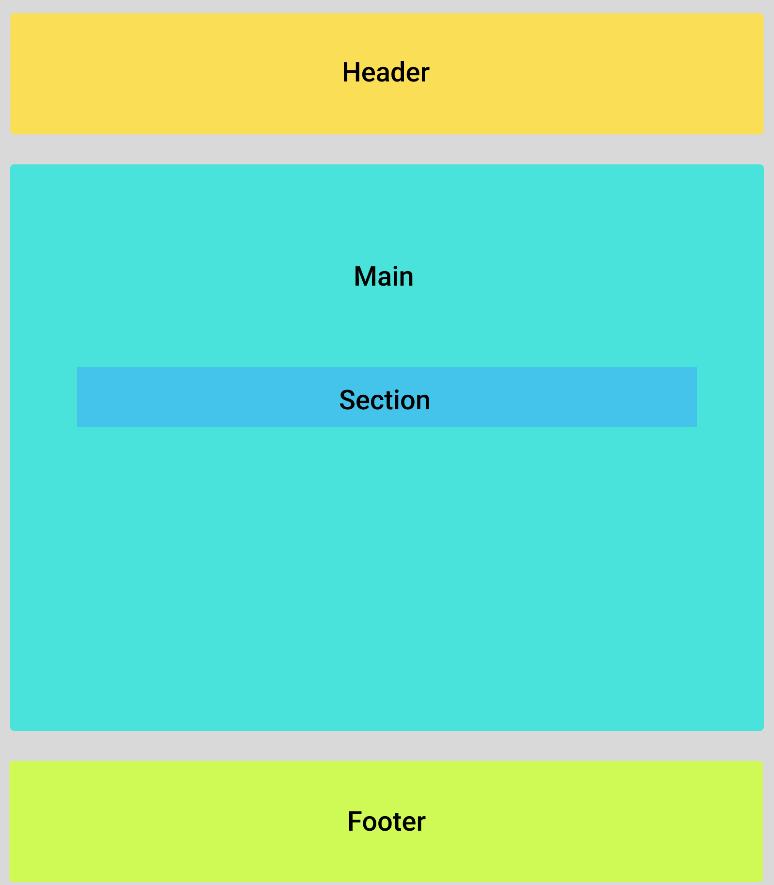
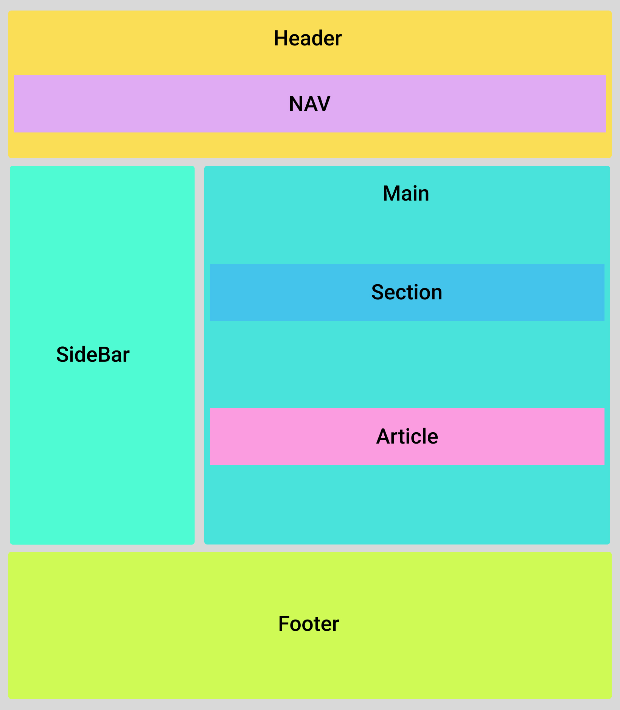
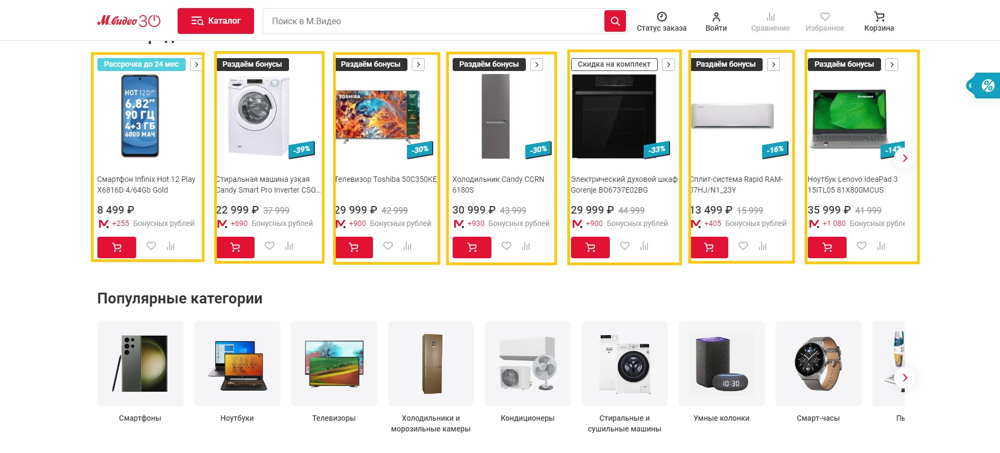
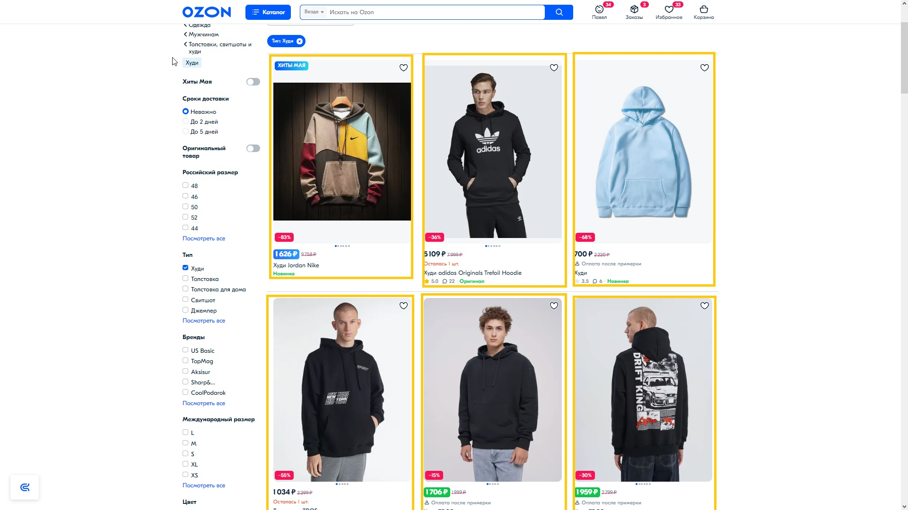
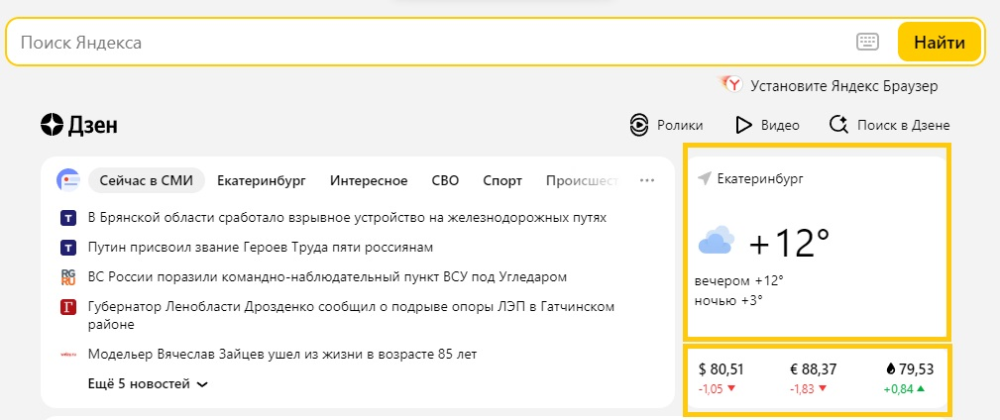

<h2 id="semantics">Понятие семантики</h2>

Из школьного курса русского языка вы должно быть помните, что семантика - раздел лингвистики, изучающий смысловое значение единиц языка. Так вот, в HTML - то же самое, только единицами языка являются не буквы, а html-теги. Некоторые из них со смыслом, некоторые нет, и в этой статье я расскажу как раз о смысловых - тех, без которых сайт сегодня представить нельзя.

Семантические теги помогают:
- Сделать сайт доступным. Зрячие пользователи могут без проблем с первого взгляда понять, где какая часть страницы находится. Для незрячих или частично незрячих всё сложнее. Основной инструмент для просмотра сайтов не браузер, который отрисовывает страницу, а скринридер, который читает текст со страницы вслух, и семантическая структура помогает ему лучше определять, какой сейчас блок, а пользователю понимать, о чём идёт речь. Таким образом семантическая разметка помогает большему количеству пользователей работать с вашим сайтом.
- Чтобы сайт был выше в поисковиках. Поисковики не разглашают правила ранжирования, но известно, что наличие семантической разметки страниц помогает поисковым ботам лучше понимать, что находится на странице, и в зависимости от этого ранжировать сайты в поисковой выдаче.

<h2 id="structure">Основная структура страницы</h2>

<figure>
  
  <figcaption>Как выглядит основная структура html-страницы</figcaption>
</figure>

### Header

Элемент `header` используется для создания шапки всего сайта или шапки отдельных компонентов. Шапка сайта - это блок с вводной информацией, в ней обычно находятся такие элементы как: логотип, меню, кнопки соцсетей, строка поиска и другие ключевые элементы.Чаще всего шапка располагается вверху страницы.

Запись `header` в коде:

``` html
<header>Шапка сайта</header>
```

<figure>
  
  <figcaption>Как выглядит header на сайте (желтый цвет)</figcaption>
</figure>

<div class="note">
  <p>
    Довольно часто встречаются случаи когда в <code>header</code> помещают контент идущий сразу после шапки (выделенный голубым цветом элемент на скриншоте выше), но правильнее  будет поместить его в тег <code>main</code>, обернув тегом <code>section</code> с классом
    <span class="tooltip">
      <button class="tooltip__btn" aria-describedby="one">"hero"</button>
      <span class="tooltip__txt" role="tooltip" id="one"><span class="visually-hidden">Тултип: </span>Так часто называют первую секцию сайта, которую пользователь видит сразу при загрузке страницы</span>
    </span>.
  </p>
</div>

### Main

В элемент `main` помещают главное содержимое — то, которое больше нигде не повторяется на сайте. В элемент main помещаются теги section - разделы сайта. Соответственно, второстепенные элементы сюда не входят: шапка сайта, подвал, боковые панели, ссылки навигации, информация об авторских правах, логотипы сайта, как правило, остаются вне контейнера `main`.

Запись `main` в коде:

``` html
<main>Основной контент страницы</main>
```

Вспомним header из нашего примера, так вот контент идущий после шапки сайта уже будет обернут в тег `main` (кроме footer-а):


### Section

Элемент `section` создает блок обертку для разделов сайта — например, цели проекта, функции продукта, партнеры, команда. Тег `section`, как правило, помещается в `main`.

Хороший пример использования `section` — разделение книги на главы, ведь название главы описывает ее содержание. Также одна глава, без остальных, воспринимается вырванной из контекста. То же самое с контентом главной страницы. Смысловые разделы составляют содержание страницы, но сами по себе, в отрыве от страницы, эти «секции» жить не могут и теряют смысл.

Запись `section` в коде:

``` html
<section>Раздел страницы</section>
```

<figure>
  
  <figcaption>Как выглядит section на сайте (желтый цвет)</figcaption>
</figure>

### Footer

Элемент `footer` создает нижнюю часть страницы или блока — «подвал». Обычно здесь находятся контакты, ссылки на разделы сайта, копирайт. В подвале мы чаще всего видим название компании, правовую информацию, ссылки на соцсети и другие контакты.

Запись `footer` в коде:

``` html
<footer>Подвал сайта</footer>
```

<figure>
  
  <figcaption>Как выглядит footer на сайте (желтый цвет)</figcaption>
</figure>

### Aside

Элемент `aside` размечает блок с дополнительным содержимым (sidebar). Он может не иметь отношения к главному (`main`) контенту сайта. Часто используется для боковой колонки на сайте, в которой может помещаться разделы сайта, реклама и т.д.

Запись `aside` в коде:

``` html
<aside>Боковая панель</aside>
```

<figure>
  
  <figcaption>Как выглядит aside на сайте (желтый цвет)</figcaption>
</figure>

Как мы можем заметить, `aside` не всегда бывает один.

<h2 id="semantic-inner">Семантическая начинка</h2>

Выше мы разобрались несколько элементов, которые составляют каркас страницы. Теперь же дополним наши знания начинкой.

<figure>
  
  <figcaption>Каркас страницы вместе с начинкой</figcaption>
</figure>

### Nav

Элемент `nav` - это контейнер в котором находятся ссылки навигации по сайту, важно отметить что `nav` будет не уместен для элементов переключения контента на сайте.

Запись `nav` в коде:

``` html
<nav>Навигация сайта</nav>
```

Зачастую навигацию располагают в тегах header и footer, обозначим nav у header из примера выше:


### Article

Элемент `article` - законченный и самодостаточный раздел документа, описывающий какую-то сущность: товар, карточку пользователя, рекламный баннер, виджет. То есть, `article` может переиспользовать на других сайтах без смысловой потери.

Запись `nav` в коде:

``` html
<article>Карточка товара, блога, или виджет погоды</article>
```

Возможные примеры тега article на разных сайтах (независимо от того, как они сделаны на реальных страницах):

<figure>
  
  <figcaption>Пример элемента article</figcaption>
</figure>

<figure>
  
  <figcaption>Пример элемента article на сайте М.Видео</figcaption>
</figure>

<figure>
  
  <figcaption>Пример элемента article на сайте Ozon</figcaption>
</figure>

<figure>
  
  <figcaption>Пример элемента article на сайте Яндекса</figcaption>
</figure>

<h2 id="semantic-mini">Прочие семантические теги</h2>

### Time

Элемент `time` служит для разметки дат, времени или периода времени: в содержимое тега идёт формат для человека, а в атрибут `datetime` версия для машин — поисковому роботу точно понравится.

Запись `time` в коде:

``` html
<time datetime="2008-02-11">11 февраля 2008</time>
```

### Em

Элемент `em` добавляет тексту внутри смысловой акцент(курсив).

Запись `em` в коде:

``` html
<p>Весна - время <em>любви</em> и <em>грусти</em>.
```

### Strong

Элемент `strong` добавляет обернутому в него слову или фразе очень высокую важность. Он может использоваться для выделения предупреждений или части документа, которую пользователь должен увидеть раньше остального.

Запись `strong` в коде:

``` html
<p> <strong>Осторожно</strong>, это контент 18+!</p>
```

### Mark

Элемент `mark` выделяет или подсвечивает важный фрагмент текста. По умолчанию браузеры добавляют `mark` желтый фоновый цвет #ffff00 (yellow), похожий на выделение канцелярским маркером.

Запись mark в коде:

``` html
<p>К основным комплектующим ПК относят <mark>процессор</mark> и <mark>материнскую плату</mark></p>
```

### Ins

Элемент `ins` используется для отображения добавленного контента. Например, нового пункта в списке дел или новой части кода.

Запись ins в коде:

``` html
<ul>
  <li>Помыть посуду</li>
  <li>Полить цветы</li>
  <li><ins>Погулять с собакой</ins></li>
  <li><ins>Пропылесосить комнату</ins></li>
</ul>
```

### Del

Элемент `del` используется для отображения удаленного контента. Например, выполненного пункта в списке дел или удалённой части кода.

Запись `del` в коде:

``` html
<ul>
  <li><del>Помыть посуду</del></li>
  <li><del>Полить цветы</del></li>
  <li>Погулять с собакой</li>
  <li>Пропылесосить комнату</li>
</ul>
```

### Abbr

Элемент `abbr` используется для вывода аббревиатур и акронимов.

Запись `abbr` в коде:

``` html
<p>
  <abbr title="Организация объединённых наций">ООН</abbr> - международная организация, созданная для поддержания и укрепления международного мира и безопасности.
</p>
```

### Sub

Элемент `sub` позволяет выводить подстрочный текст, например, в химических формулах: H<sub>2</sub>O.

Запись `sub` в коде:

``` html
<p>Вода - бинарное неорганическое соединение с химической формулой H<sub>2</sub>O.</p>
```

### Sup

Элемент `sup` позволяет выводить надстрочный текст, например, в математических уравнениях: c<sup>2</sup> = a<sup>2</sup> + b<sup>2</sup>.

Запись `sup` в коде:

``` html
<p>Теорема Пифагора - c<sup>2</sup> =a<sup>2</sup> + b<sup>2</sup>.</p>
```

### Var

Элемент `var` используется для отображения переменных в математических выражениях и программном коде: x = 2y + 6.

Запись `var` в коде:

``` html
<p>В <var>x</var> случаях тебе повезёт, но в 2<var>x</var> случаях ты проиграешь </p>
```

### Data

Элемент `data` позволяет хранить в своем содержимом данные в формате, понятном человеку, а в атрибуте ``value` — в формате, понятном машинам.

Запись `data` в коде:

``` html
Жили у бабуси <data value="2">два</data> весёлых гуся.
```

### Kbd

Элемент `kbd` обозначает пользовательский ввод: с клавиатуры, голосом, указателем или другим образом.

Запись `kbd` в коде:

``` html
<p>Для вызова справки нажмите <kbd>shift+?</kbd>.</p>
```

### Cite

Элемент `cite` используется для указания источников цитат, названий художественных произведений или объектов искусства.

Запись `cite` в коде:

``` html
<p>
  Из множества фильмов Marvel я больше всего люблю <cite>Мстители: Война Бесконечности</cite>.
</p>
```

<h2 id="conslusion">Заключение</h2>

Семантические теги - неотъемлемая часть без которой не обходится ни одна современная web-страница. Данные элементы позволяют:

- Сделать сайт доступным для любого человека
- Помочь сайту лучше ранжироваться в поисковых системах.

Пишите код с умом, всем удачи, до скорых встреч)
